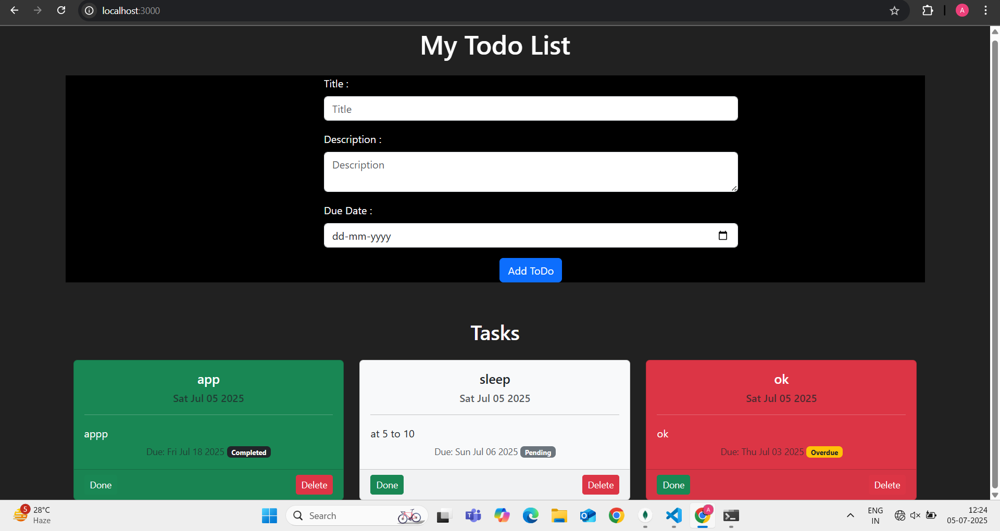

# 📝 Todo App

A simple Todo application built using **Node.js**, **Express**, **MongoDB**, and **EJS** — styled with **Bootstrap 5**.

---

## 🚀 Features

- ✅ Add new tasks with title, description, and due date
- ✅ Mark tasks as completed
- ⚠️ Highlights overdue tasks in red
- ✅ Delete tasks
- ✅ Visual indicators (green = done, red = overdue)
- 🎨 Responsive design with Bootstrap
- 🗂 Organized routes and model structure

---

## 💻 Tech Stack

- **Backend:** Node.js, Express.js
- **Database:** MongoDB + Mongoose
- **Templating:** EJS
- **Styling:** Bootstrap 5
- **Utilities:** Method-override
